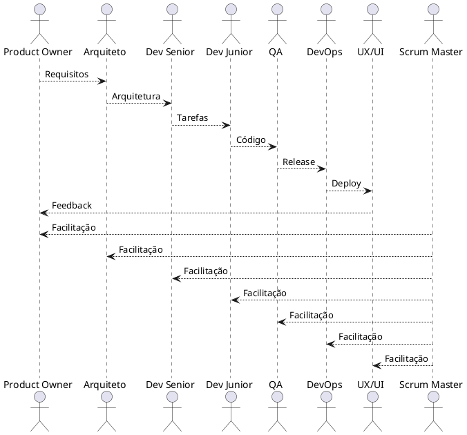

# Documentação de Papéis em Engenharia de Software

## Visão Geral
Este projeto contém a documentação detalhada dos diferentes papéis envolvidos no desenvolvimento de uma extensão Chrome integrada com Flowise e Databricks. Cada papel tem suas responsabilidades específicas e contribui para o sucesso do projeto.

## Estrutura do Projeto
```
ai-software-enginners-docs/
├── README.md
├── product_owner.md
├── arquiteto_software.md
├── gerente_projetos.md
├── analista_requisitos.md
├── desenvolvedor_senior.md
├── desenvolvedor_junior.md
├── qa_analyst.md
├── designer_ux_ui.md
├── devops_engineer.md
├── analista_seguranca.md
└── scrum_master.md
```

## Papéis e Responsabilidades

### [Product Owner](./product_owner.md)
- Gerenciamento do Product Backlog
- Definição de requisitos
- Priorização de funcionalidades
- Interface com stakeholders

### [Arquiteto de Software](./arquiteto_software.md)
- Definição da arquitetura
- Padrões técnicos
- Decisões tecnológicas
- Escalabilidade e performance

### [Gerente de Projetos](./gerente_projetos.md)
- Planejamento e execução
- Gestão de recursos
- Controle de prazos
- Gestão de riscos

### [Analista de Requisitos](./analista_requisitos.md)
- Levantamento de requisitos
- Documentação funcional
- Regras de negócio
- Validação com stakeholders

### [Desenvolvedor Sênior](./desenvolvedor_senior.md)
- Implementação core
- Code review
- Mentoria técnica
- Padrões de código

### [Desenvolvedor Júnior](./desenvolvedor_junior.md)
- Implementação de features
- Correção de bugs
- Testes unitários
- Documentação técnica

### [QA Analyst](./qa_analyst.md)
- Estratégia de testes
- Automação
- Garantia de qualidade
- Relatórios de bugs

### [Designer UX/UI](./designer_ux_ui.md)
- Design system
- Protótipos
- Experiência do usuário
- Interface gráfica

### [DevOps Engineer](./devops_engineer.md)
- Infraestrutura
- CI/CD
- Monitoramento
- Automação

### [Analista de Segurança](./analista_seguranca.md)
- Segurança da aplicação
- Testes de penetração
- Políticas de segurança
- Conformidade

### [Scrum Master](./scrum_master.md)
- Facilitação Scrum
- Remoção de impedimentos
- Melhoria contínua
- Coaching ágil

## Fluxo de Trabalho



## Como Contribuir
1. Clone o repositório
2. Crie uma branch para suas alterações
3. Faça as modificações necessárias
4. Submeta um pull request
5. Aguarde a revisão

## Licença
Este projeto está sob a licença MIT. Veja o arquivo [LICENSE](./LICENSE) para mais detalhes. 