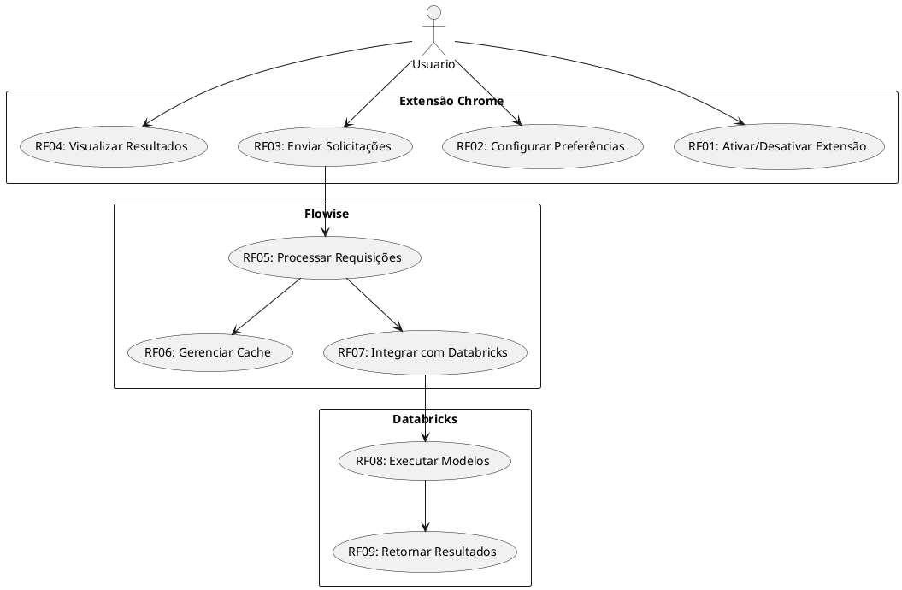
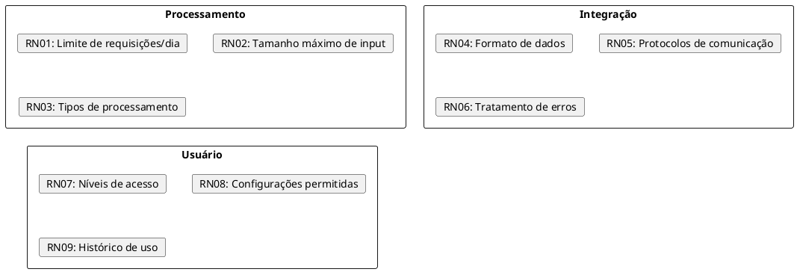
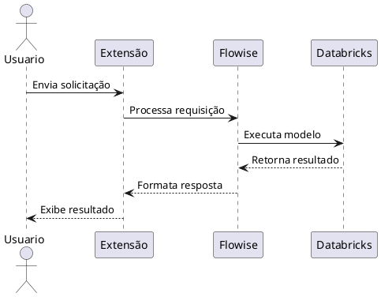
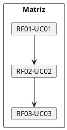

# Documentação do Analista de Requisitos

## Descrição do Papel
O Analista de Requisitos é responsável por identificar, documentar e validar os requisitos do sistema junto aos stakeholders, garantindo que todas as necessidades sejam adequadamente capturadas e especificadas.

## Execução das Responsabilidades no Projeto

### 1. Requisitos Funcionais

### 2. Requisitos Não Funcionais

#### Performance
- RNF01: Tempo de resposta < 2 segundos
- RNF02: Suporte a 1000 usuários simultâneos
- RNF03: Cache com hit rate > 80%

#### Segurança
- RNF04: Criptografia end-to-end
- RNF05: Autenticação JWT
- RNF06: Rate limiting por usuário

#### Usabilidade
- RNF07: Interface intuitiva
- RNF08: Feedback visual de processamento
- RNF09: Documentação de uso

### 3. Regras de Negócio

### 4. Casos de Uso

#### UC01: Processar Solicitação de IA

## Matriz de Rastreabilidade

### 1. Requisitos x Casos de Uso

## Validação de Requisitos

### 1. Critérios de Aceitação
- Testes de usabilidade
- Verificação de performance
- Validação de segurança
- Conformidade com padrões

### 2. Processo de Validação
- Revisões com stakeholders
- Protótipos e mockups
- Testes de aceitação
- Feedback dos usuários

## Principais Entregáveis
1. Documento de Requisitos
2. Especificação de Casos de Uso
3. Matriz de Rastreabilidade
4. Protótipos de Interface
5. Critérios de Aceitação

## Métricas de Qualidade
- Cobertura dos requisitos
- Clareza da documentação
- Consistência das especificações
- Validação com stakeholders
- Feedback dos desenvolvedores 