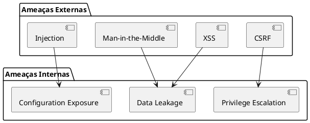
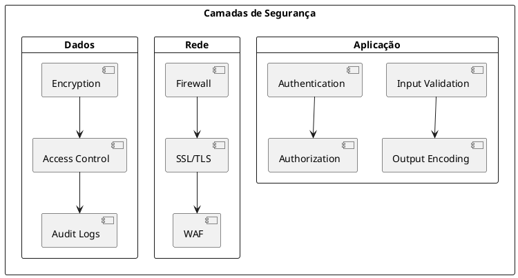
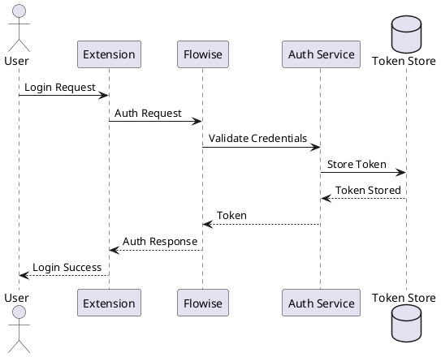
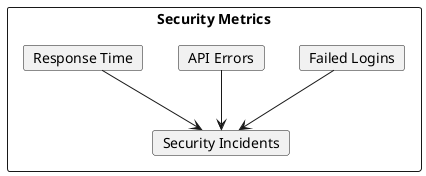

# Documentação do Analista de Segurança

## Descrição do Papel
O Analista de Segurança é responsável por garantir a segurança da aplicação, realizando auditorias, implementando controles de segurança e assegurando a conformidade com padrões e regulamentações.

## Execução das Responsabilidades no Projeto

### 1. Modelo de Ameaças



### 2. Controles de Segurança



### 3. Políticas de Segurança

```typescript
// Exemplo de middleware de segurança
const securityMiddleware = {
  // Headers de segurança
  headers: {
    'Content-Security-Policy': "default-src 'self'",
    'X-Frame-Options': 'DENY',
    'X-XSS-Protection': '1; mode=block',
    'X-Content-Type-Options': 'nosniff',
    'Referrer-Policy': 'strict-origin-when-cross-origin'
  },
  
  // Rate limiting
  rateLimit: {
    windowMs: 15 * 60 * 1000, // 15 minutos
    max: 100 // limite por IP
  },
  
  // CORS
  cors: {
    origin: ['chrome-extension://*'],
    methods: ['GET', 'POST'],
    allowedHeaders: ['Content-Type', 'Authorization']
  }
};
```

### 4. Fluxo de Autenticação



## Implementação de Segurança

### 1. Validação de Input
```typescript
// Exemplo de validação de input
const validateInput = (input: string): boolean => {
  // Remover caracteres perigosos
  const sanitized = input.replace(/[<>'"]/g, '');
  
  // Validar tamanho
  if (sanitized.length > 1000) {
    return false;
  }
  
  // Validar conteúdo
  const pattern = /^[a-zA-Z0-9\s.,!?-]+$/;
  return pattern.test(sanitized);
};
```

### 2. Criptografia
```typescript
// Exemplo de criptografia
import * as crypto from 'crypto';

const encrypt = (text: string, key: Buffer): string => {
  const iv = crypto.randomBytes(16);
  const cipher = crypto.createCipheriv('aes-256-gcm', key, iv);
  
  let encrypted = cipher.update(text, 'utf8', 'hex');
  encrypted += cipher.final('hex');
  
  const authTag = cipher.getAuthTag();
  
  return iv.toString('hex') + ':' + encrypted + ':' + authTag.toString('hex');
};
```

### 3. Logs de Segurança
```typescript
// Exemplo de logging de segurança
interface SecurityLog {
  timestamp: Date;
  event: string;
  severity: 'low' | 'medium' | 'high' | 'critical';
  details: Record<string, unknown>;
  source: string;
}

const logSecurityEvent = (log: SecurityLog): void => {
  // Logging para sistema centralizado
  console.log(JSON.stringify(log));
};
```

## Monitoramento de Segurança

### 1. Alertas
```yaml
# security-alerts.yml
rules:
  - name: bruteforce_detection
    condition: login_failures > 5
    period: 5m
    severity: high
    action: block_ip

  - name: suspicious_activity
    condition: api_calls > 1000
    period: 1m
    severity: medium
    action: notify_admin
```

### 2. Métricas


## Testes de Segurança

### 1. Penetration Testing
```bash
#!/bin/bash
# security-scan.sh

# Executar OWASP ZAP
zap-cli quick-scan --self-contained \
  --start-options "-config api.disablekey=true" \
  --spider https://api.flowise.com

# Executar Nmap
nmap -sV -sC -p- api.flowise.com

# Executar SSL Test
sslyze --regular api.flowise.com:443
```

### 2. Análise de Código
```yaml
# security-scan.yml
sast:
  sonarqube:
    projectKey: flowise
    sources: src
    exclusions: "**/*.test.ts"
    
  dependencies:
    - npm audit
    - snyk test
    
  custom_rules:
    - pattern: "eval\\("
      message: "Avoid using eval"
      severity: BLOCKER
```

## Principais Entregáveis
1. Relatório de vulnerabilidades
2. Políticas de segurança
3. Implementação de controles
4. Documentação de segurança
5. Plano de resposta a incidentes

## Métricas de Segurança
- Vulnerabilidades identificadas
- Tempo de resolução
- Incidentes de segurança
- Cobertura de testes
- Conformidade com padrões 