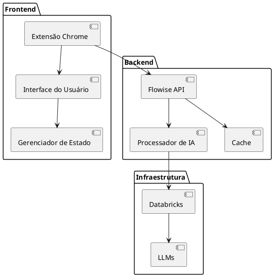
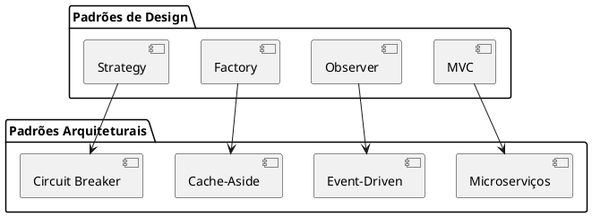
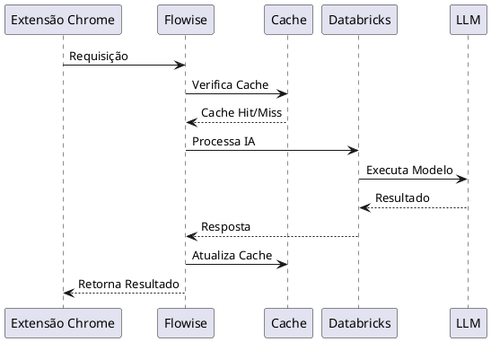

# Documentação do Arquiteto de Software

## Descrição do Papel
O Arquiteto de Software é responsável por definir a estrutura técnica do sistema, garantindo escalabilidade, manutenibilidade e performance. No contexto deste projeto, o arquiteto define como a extensão Chrome, Flowise e Databricks se integrarão de forma eficiente.

## Execução das Responsabilidades no Projeto

### 1. Arquitetura do Sistema

### 2. Componentes Principais

#### Extensão Chrome
- Framework: React/TypeScript
- Estado: Redux/Context API
- Armazenamento: Chrome Storage API
- Comunicação: REST API

#### Flowise
- Runtime: Node.js
- API: REST com Express
- Cache: Redis
- Logging: Winston

#### Databricks
- Ambiente: ML Runtime
- Modelos: PyTorch/TensorFlow
- Escalabilidade: Auto Scaling
- Monitoramento: Prometheus

### 3. Padrões Arquiteturais

### 4. Fluxo de Dados

## Decisões Técnicas

### 1. Segurança
- Autenticação: JWT
- HTTPS obrigatório
- Rate Limiting
- Sanitização de inputs
- Criptografia em trânsito

### 2. Performance
- Lazy Loading
- Compressão de dados
- Cache em múltiplas camadas
- Otimização de assets

### 3. Escalabilidade
- Arquitetura stateless
- Load balancing
- Auto-scaling
- Particionamento de dados

## Principais Entregáveis
1. Documentação da arquitetura
2. Diagramas técnicos
3. Guias de implementação
4. Padrões de código
5. Requisitos não-funcionais

## Métricas Técnicas
- Tempo de resposta
- Throughput
- Taxa de erro
- Uso de recursos
- Disponibilidade do sistema 