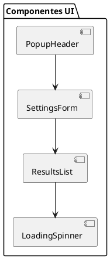
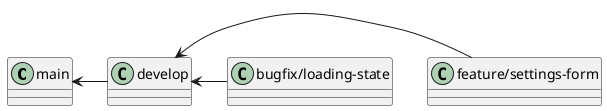

# Documentação do Desenvolvedor Júnior

## Descrição do Papel
O Desenvolvedor Júnior é responsável por implementar funcionalidades específicas sob orientação do Desenvolvedor Sênior, seguindo os padrões estabelecidos e contribuindo com o desenvolvimento do projeto.

## Execução das Responsabilidades no Projeto

### 1. Componentes da Interface



### 2. Implementação de Features

#### Exemplo de Componente React
```typescript
// components/SettingsForm.tsx
import React, { useState } from 'react';

interface SettingsFormProps {
  onSave: (settings: Settings) => void;
}

const SettingsForm: React.FC<SettingsFormProps> = ({ onSave }) => {
  const [settings, setSettings] = useState<Settings>({
    apiKey: '',
    theme: 'light',
    notifications: true
  });

  const handleSubmit = (e: React.FormEvent) => {
    e.preventDefault();
    onSave(settings);
  };

  return (
    <form onSubmit={handleSubmit}>
      {/* Implementação do formulário */}
    </form>
  );
};
```

#### Exemplo de Estilização
```css
/* styles/SettingsForm.css */
.settings-form {
  padding: 1rem;
  background: #ffffff;
  border-radius: 8px;
  box-shadow: 0 2px 4px rgba(0,0,0,0.1);
}

.form-group {
  margin-bottom: 1rem;
}

.form-input {
  width: 100%;
  padding: 0.5rem;
  border: 1px solid #ddd;
  border-radius: 4px;
}
```

### 3. Testes Unitários

```typescript
// __tests__/SettingsForm.test.tsx
import { render, fireEvent } from '@testing-library/react';
import SettingsForm from '../components/SettingsForm';

describe('SettingsForm', () => {
  it('should update settings on form submission', () => {
    const onSave = jest.fn();
    const { getByTestId } = render(<SettingsForm onSave={onSave} />);
    
    // Implementação do teste
  });
});
```

### 4. Fluxo de Trabalho

```plantuml
@startuml
start
:Receber tarefa do Desenvolvedor Sênior;
:Estudar requisitos;
:Implementar componente/feature;
:Escrever testes;
:Solicitar code review;

if (Aprovado?) then (sim)
  :Fazer merge;
else (não)
  :Fazer correções;
  goto Solicitar code review;
endif

stop
@enduml
```

## Guia de Desenvolvimento

### 1. Setup do Ambiente
```bash
# Instalação de dependências
npm install

# Rodar em desenvolvimento
npm run dev

# Executar testes
npm test

# Build para produção
npm run build
```

### 2. Padrões de Código

#### Nomenclatura
- Componentes: PascalCase
- Funções: camelCase
- Constantes: UPPER_SNAKE_CASE
- Arquivos de componente: PascalCase.tsx
- Arquivos de estilo: PascalCase.css

#### Estrutura de Arquivos
```
src/
  components/
    SettingsForm/
      index.tsx
      styles.css
      tests/
        index.test.tsx
  hooks/
    useSettings.ts
  utils/
    api.ts
  types/
    index.ts
```

### 3. Boas Práticas

#### React
- Usar componentes funcionais
- Implementar PropTypes
- Manter componentes pequenos
- Utilizar Custom Hooks
- Seguir princípio de responsabilidade única

#### TypeScript
- Definir interfaces/types
- Usar tipos explícitos
- Evitar any
- Documentar funções complexas

#### CSS
- Usar metodologia BEM
- Manter especificidade baixa
- Utilizar variáveis CSS
- Seguir guia de estilo do projeto

## Fluxo de Git

### 1. Branches


### 2. Commits
- feat: nova funcionalidade
- fix: correção de bug
- docs: documentação
- style: formatação
- refactor: refatoração
- test: testes

## Principais Entregáveis
1. Componentes UI
2. Testes unitários
3. Documentação de código
4. Correções de bugs
5. Melhorias incrementais

## Métricas de Desenvolvimento
- Qualidade do código
- Cobertura de testes
- Velocidade de entrega
- Bugs reportados
- Participação em code reviews 