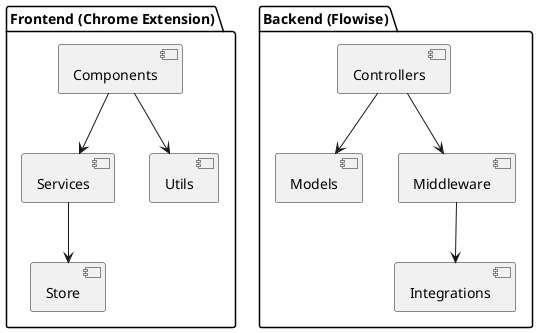
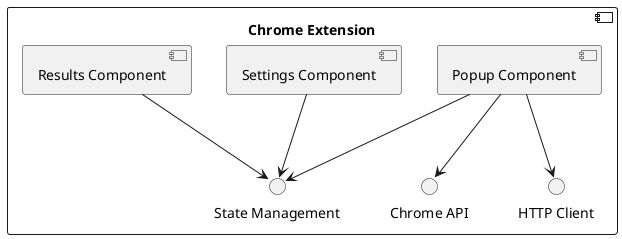
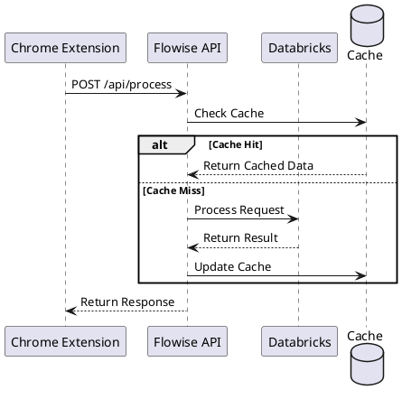

# Documentação do Desenvolvedor Sênior

## Descrição do Papel
O Desenvolvedor Sênior é responsável por liderar o desenvolvimento técnico, definir padrões de código, realizar code reviews e mentoriar desenvolvedores júniors. No contexto deste projeto, atua na implementação das funcionalidades core e integrações críticas.

## Execução das Responsabilidades no Projeto

### 1. Arquitetura de Código



### 2. Estrutura de Componentes



### 3. Padrões de Implementação

#### Frontend (TypeScript/React)
```typescript
// Exemplo de estrutura de componente
interface Props {
  data: RequestData;
  onSubmit: (data: ResponseData) => void;
}

const AIProcessor: React.FC<Props> = ({ data, onSubmit }) => {
  // Implementação
}

// Exemplo de serviço
class AIService {
  private readonly api: APIClient;
  
  constructor() {
    this.api = new APIClient();
  }
  
  async processRequest(data: RequestData): Promise<ResponseData> {
    // Implementação
  }
}
```

#### Backend (Node.js)
```typescript
// Exemplo de controller
class AIController {
  private service: AIService;
  
  constructor() {
    this.service = new AIService();
  }
  
  async process(req: Request, res: Response) {
    // Implementação
  }
}

// Exemplo de middleware
const authMiddleware = async (req: Request, res: Response, next: NextFunction) => {
  // Implementação
}
```

### 4. Fluxo de Dados



## Padrões e Boas Práticas

### 1. Código
- Clean Code
- SOLID Principles
- DRY (Don't Repeat Yourself)
- KISS (Keep It Simple, Stupid)
- Design Patterns apropriados

### 2. Testes
```typescript
// Exemplo de teste unitário
describe('AIService', () => {
  it('should process request successfully', async () => {
    // Implementação
  });
  
  it('should handle errors properly', async () => {
    // Implementação
  });
});
```

### 3. Code Review
- Verificação de padrões
- Performance
- Segurança
- Testabilidade
- Documentação

## Integrações

### 1. Flowise API
```typescript
interface FlowiseConfig {
  baseUrl: string;
  timeout: number;
  retries: number;
}

class FlowiseClient {
  constructor(config: FlowiseConfig) {
    // Implementação
  }
  
  async process(data: RequestData): Promise<ResponseData> {
    // Implementação
  }
}
```

### 2. Databricks
```typescript
interface DatabricksConfig {
  endpoint: string;
  token: string;
  modelId: string;
}

class DatabricksClient {
  constructor(config: DatabricksConfig) {
    // Implementação
  }
  
  async executeModel(input: ModelInput): Promise<ModelOutput> {
    // Implementação
  }
}
```

## Principais Entregáveis
1. Arquitetura de código
2. Implementação core
3. Integrações críticas
4. Testes automatizados
5. Documentação técnica

## Métricas de Qualidade
- Cobertura de testes
- Complexidade ciclomática
- Débito técnico
- Performance
- Segurança 