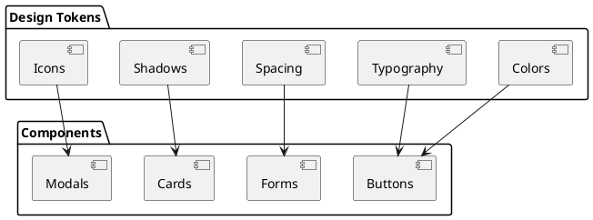
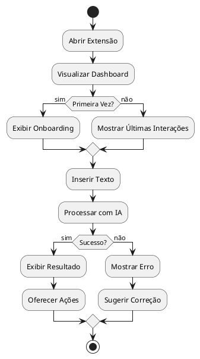
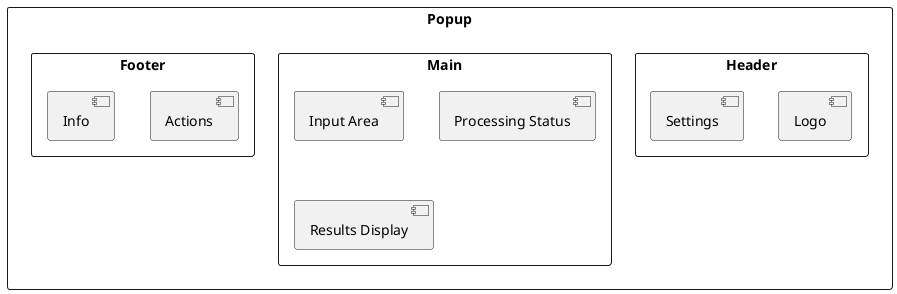
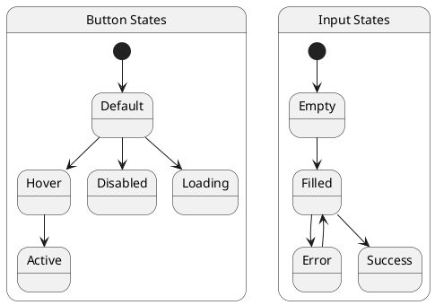
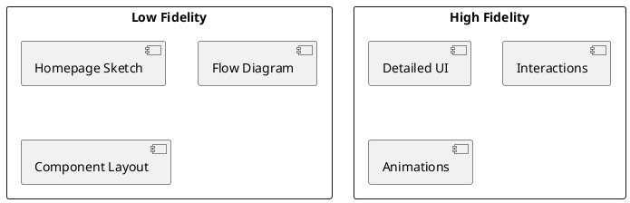

# Documentação do Designer UX/UI

## Descrição do Papel
O Designer UX/UI é responsável por criar uma experiência de usuário intuitiva e agradável para a extensão Chrome, garantindo usabilidade, acessibilidade e consistência visual em toda a aplicação.

## Execução das Responsabilidades no Projeto

### 1. Design System



### 2. Paleta de Cores
```css
:root {
  /* Cores Primárias */
  --primary-100: #E6F3FF;
  --primary-500: #0066CC;
  --primary-900: #003366;

  /* Cores Secundárias */
  --secondary-100: #F0F4F8;
  --secondary-500: #64748B;
  --secondary-900: #1E293B;

  /* Cores de Feedback */
  --success: #22C55E;
  --warning: #F59E0B;
  --error: #EF4444;
  --info: #3B82F6;
}
```

### 3. Tipografia
```css
:root {
  /* Font Family */
  --font-primary: 'Inter', sans-serif;
  --font-secondary: 'Roboto', sans-serif;

  /* Font Sizes */
  --text-xs: 0.75rem;
  --text-sm: 0.875rem;
  --text-base: 1rem;
  --text-lg: 1.125rem;
  --text-xl: 1.25rem;
  --text-2xl: 1.5rem;
}
```

### 4. Fluxo de Usuário



## Componentes UI

### 1. Estrutura da Interface


### 2. Componentes Base
```typescript
// components/Button/Button.tsx
interface ButtonProps {
  variant: 'primary' | 'secondary' | 'ghost';
  size: 'sm' | 'md' | 'lg';
  icon?: ReactNode;
  children: ReactNode;
  onClick: () => void;
}

// components/Input/Input.tsx
interface InputProps {
  type: 'text' | 'number';
  placeholder: string;
  value: string;
  onChange: (value: string) => void;
  error?: string;
}
```

### 3. Estados Visuais


## Princípios de Design

### 1. Usabilidade
- Feedback imediato
- Prevenção de erros
- Consistência
- Eficiência
- Flexibilidade

### 2. Acessibilidade
- Contraste adequado
- Suporte a teclado
- Textos alternativos
- Tamanhos ajustáveis
- ARIA labels

### 3. Responsividade
```css
/* Breakpoints */
:root {
  --bp-sm: 640px;
  --bp-md: 768px;
  --bp-lg: 1024px;
  --bp-xl: 1280px;
}

/* Media Queries */
@media (min-width: 640px) {
  .container {
    max-width: var(--bp-sm);
  }
}
```

## Protótipos

### 1. Wireframes


### 2. Interações
```css
/* Animations */
.fade-in {
  animation: fadeIn 0.3s ease-in;
}

.slide-up {
  animation: slideUp 0.4s ease-out;
}

/* Transitions */
.button {
  transition: all 0.2s ease;
}

.modal {
  transition: opacity 0.3s, transform 0.3s;
}
```

## Principais Entregáveis
1. Design System
2. Protótipos interativos
3. Guia de estilo
4. Assets e ícones
5. Documentação de componentes

## Métricas de Design
- Satisfação do usuário
- Taxa de conversão
- Tempo de conclusão
- Taxa de erro
- Engajamento 