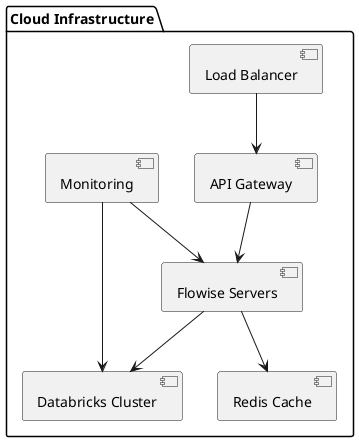
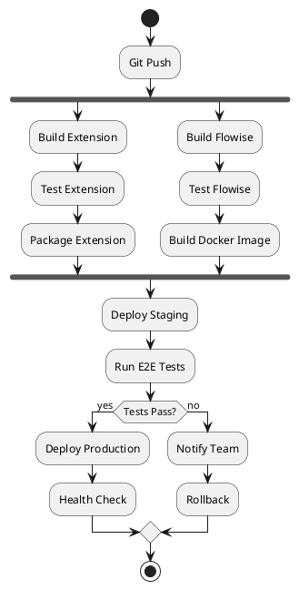
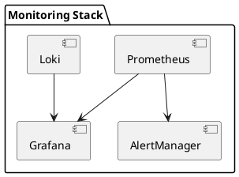
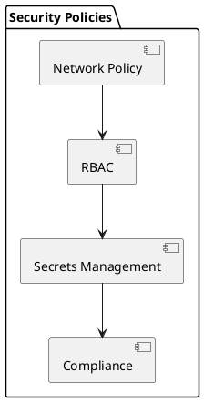

# Documentação do DevOps Engineer

## Descrição do Papel
O DevOps Engineer é responsável por implementar e manter a infraestrutura, pipeline de CI/CD, monitoramento e segurança do projeto, garantindo alta disponibilidade e performance.

## Execução das Responsabilidades no Projeto

### 1. Infraestrutura como Código



### 2. Pipeline CI/CD



### 3. Configuração de Ambiente

```yaml
# docker-compose.yml
version: '3.8'

services:
  flowise:
    build: ./flowise
    ports:
      - "3000:3000"
    environment:
      - NODE_ENV=production
      - DATABRICKS_URL=${DATABRICKS_URL}
      - DATABRICKS_TOKEN=${DATABRICKS_TOKEN}
    depends_on:
      - redis

  redis:
    image: redis:6.2-alpine
    ports:
      - "6379:6379"
    volumes:
      - redis-data:/data

volumes:
  redis-data:
```

### 4. Monitoramento



## Configurações

### 1. Kubernetes
```yaml
# deployment.yaml
apiVersion: apps/v1
kind: Deployment
metadata:
  name: flowise
spec:
  replicas: 3
  selector:
    matchLabels:
      app: flowise
  template:
    metadata:
      labels:
        app: flowise
    spec:
      containers:
      - name: flowise
        image: flowise:latest
        ports:
        - containerPort: 3000
        resources:
          limits:
            cpu: "1"
            memory: "1Gi"
          requests:
            cpu: "500m"
            memory: "512Mi"
```

### 2. Prometheus
```yaml
# prometheus.yml
global:
  scrape_interval: 15s

scrape_configs:
  - job_name: 'flowise'
    static_configs:
      - targets: ['flowise:3000']

  - job_name: 'databricks'
    static_configs:
      - targets: ['databricks:443']
```

### 3. Alertas
```yaml
# alerts.yml
groups:
- name: flowise
  rules:
  - alert: HighLatency
    expr: http_request_duration_seconds > 2
    for: 5m
    labels:
      severity: critical
    annotations:
      description: "High latency detected"
```

## Segurança

### 1. Políticas


### 2. SSL/TLS
```nginx
# nginx.conf
server {
    listen 443 ssl;
    server_name api.flowise.com;

    ssl_certificate /etc/nginx/ssl/flowise.crt;
    ssl_certificate_key /etc/nginx/ssl/flowise.key;

    ssl_protocols TLSv1.2 TLSv1.3;
    ssl_ciphers HIGH:!aNULL:!MD5;

    location / {
        proxy_pass http://flowise:3000;
        proxy_set_header Host $host;
        proxy_set_header X-Real-IP $remote_addr;
    }
}
```

## Automação

### 1. Scripts
```bash
#!/bin/bash
# deploy.sh

# Build and push Docker image
docker build -t flowise:latest .
docker push flowise:latest

# Update Kubernetes deployment
kubectl apply -f k8s/
kubectl rollout status deployment/flowise

# Run health checks
./health-check.sh
```

### 2. Backup
```bash
#!/bin/bash
# backup.sh

# Backup Redis data
redis-cli save
cp /data/dump.rdb /backups/redis_$(date +%Y%m%d).rdb

# Backup configurations
cp -r /etc/flowise/config /backups/config_$(date +%Y%m%d)
```

## Principais Entregáveis
1. Infraestrutura automatizada
2. Pipeline CI/CD
3. Sistema de monitoramento
4. Políticas de segurança
5. Documentação de operações

## Métricas DevOps
- Tempo de deploy
- Uptime do sistema
- MTTR (Mean Time To Recovery)
- Taxa de falhas
- Performance da aplicação 