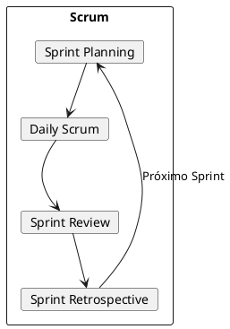
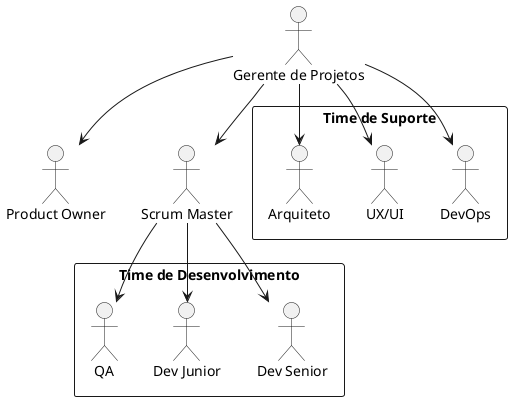
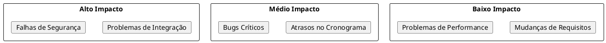

# Documentação do Gerente de Projetos

## Descrição do Papel
O Gerente de Projetos é responsável por planejar, executar e monitorar o projeto, garantindo que as entregas sejam realizadas dentro do prazo, custo e qualidade estabelecidos, utilizando metodologias ágeis.

## Execução das Responsabilidades no Projeto

### 1. Metodologia Ágil


### 2. Cronograma do Projeto

```plantuml
@startuml
project starts 2024-03-01
[Planejamento] as [P] lasts 10 days
[Setup Inicial] as [SI] lasts 15 days
[Desenvolvimento Frontend] as [DF] lasts 30 days
[Integração Flowise] as [IF] lasts 20 days
[Integração Databricks] as [ID] lasts 25 days
[Testes] as [T] lasts 15 days
[Deploy] as [D] lasts 5 days

[P] -> [SI]
[SI] -> [DF]
[DF] -> [IF]
[IF] -> [ID]
[ID] -> [T]
[T] -> [D]
@enduml
```

### 3. Estrutura da Equipe


## Gestão de Riscos

### 1. Matriz de Riscos


### 2. Plano de Mitigação
- Reuniões diárias de acompanhamento
- Revisões de código frequentes
- Testes automatizados
- Documentação detalhada
- Backups e contingências

## Comunicação

### 1. Canais
- Reuniões diárias: 15 minutos
- Reuniões de sprint: 2 horas
- Retrospectivas: 1 hora
- Comunicação assíncrona: Slack/Teams

### 2. Relatórios
- Status semanal
- Burndown chart
- Velocity chart
- Relatório de riscos
- Indicadores de qualidade

## Principais Entregáveis
1. Plano de projeto
2. Cronograma detalhado
3. Relatórios de progresso
4. Documentação de riscos
5. Métricas de projeto

## KPIs do Projeto
- Velocidade da equipe
- Burndown do projeto
- Qualidade das entregas
- Satisfação do cliente
- ROI do projeto 