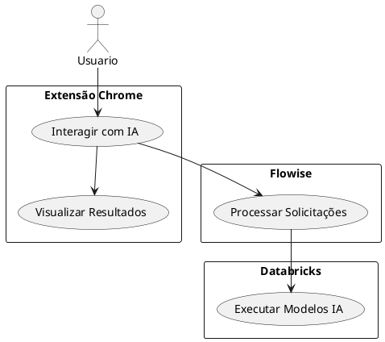
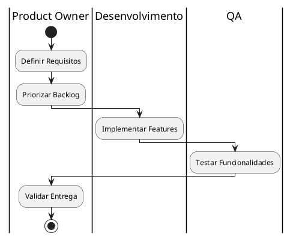

# Documentação do Product Owner

## Descrição do Papel
O Product Owner é responsável por maximizar o valor do produto e gerenciar efetivamente o Product Backlog. No contexto deste projeto de extensão Chrome integrada com Flowise e Databricks, o PO atua como ponte entre stakeholders e time de desenvolvimento.

## Execução das Responsabilidades no Projeto

### 1. Histórias de Usuário

### 2. Backlog do Produto

#### Épicos
1. **Integração com Navegador**
   - Desenvolvimento da extensão Chrome
   - Interface do usuário intuitiva
   - Gestão de estados e dados locais

2. **Processamento de IA**
   - Integração com Flowise
   - Configuração do Databricks
   - Otimização de respostas

#### Histórias Principais
1. Como usuário, quero poder ativar a extensão do Chrome com um clique
2. Como usuário, quero enviar solicitações para processamento de IA
3. Como usuário, quero visualizar as respostas em tempo real
4. Como usuário, quero poder configurar preferências de processamento

### 3. Critérios de Aceitação

#### Para a Extensão Chrome:
- Interface responsiva e moderna
- Tempo de resposta inferior a 2 segundos
- Suporte a múltiplas abas
- Armazenamento local de configurações

#### Para Integração Flowise:
- Conexão segura via API REST
- Tratamento adequado de erros
- Logs de processamento
- Cache de respostas frequentes

#### Para Processamento Databricks:
- Tempo máximo de processamento definido
- Fallback para erros de modelo
- Monitoramento de uso
- Otimização de recursos

## Fluxo de Trabalho

## Principais Entregáveis
1. Product Backlog refinado e priorizado
2. Critérios de aceitação detalhados
3. Roadmap do produto
4. Documentação de features
5. Métricas de sucesso do produto

## KPIs e Métricas
- Tempo médio de resposta da IA
- Taxa de satisfação do usuário
- Número de usuários ativos
- Taxa de conversão
- Retenção de usuários 