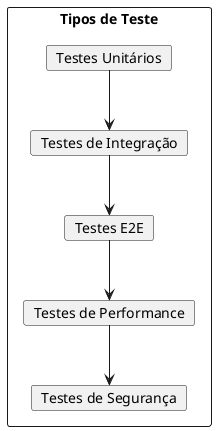
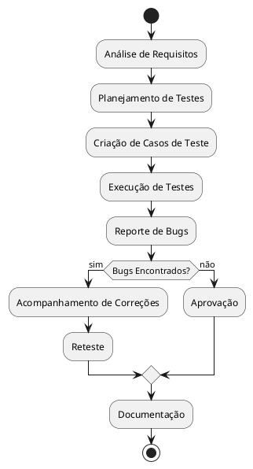
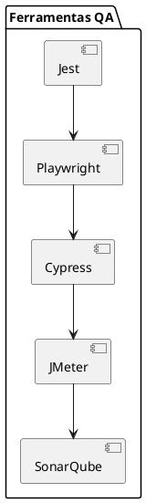
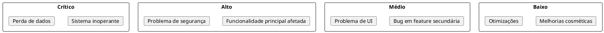
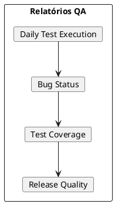

# Documentação do QA Analyst

## Descrição do Papel
O QA Analyst é responsável por garantir a qualidade do software através de testes manuais e automatizados, identificação de bugs, validação de requisitos e melhoria contínua dos processos de qualidade.

## Execução das Responsabilidades no Projeto

### 1. Estratégia de Testes



### 2. Casos de Teste

#### Extensão Chrome
```gherkin
Feature: Processamento de IA
  Scenario: Usuário envia solicitação válida
    Given que o usuário está na extensão
    When ele insere um texto válido
    And clica em processar
    Then a solicitação é enviada ao Flowise
    And o resultado é exibido corretamente

  Scenario: Tratamento de erro
    Given que o usuário está na extensão
    When ocorre um erro de processamento
    Then uma mensagem de erro apropriada é exibida
    And o sistema permite nova tentativa
```

### 3. Automação de Testes

```typescript
// tests/e2e/extension.spec.ts
import { test, expect } from '@playwright/test';

test.describe('Chrome Extension', () => {
  test('should process AI request successfully', async ({ page }) => {
    // Setup
    await page.goto('chrome-extension://id/popup.html');
    
    // Actions
    await page.fill('#input-text', 'Test query');
    await page.click('#process-button');
    
    // Assertions
    await expect(page.locator('.result')).toBeVisible();
    await expect(page.locator('.error')).toBeHidden();
  });
});
```

### 4. Fluxo de Testes



## Plano de Testes

### 1. Testes Funcionais
- Validação de inputs
- Processamento de IA
- Integração com Flowise
- Cache de resultados
- Tratamento de erros

### 2. Testes Não-Funcionais
- Performance
- Segurança
- Usabilidade
- Compatibilidade
- Escalabilidade

### 3. Ferramentas


## Processo de Bug Tracking

### 1. Template de Bug Report
```markdown
## Descrição do Bug
[Descrição clara e concisa do bug]

## Passos para Reproduzir
1. Vá para '...'
2. Clique em '....'
3. Role até '....'
4. Veja o erro

## Comportamento Esperado
[Descrição do que deveria acontecer]

## Screenshots
[Se aplicável, adicione screenshots]

## Ambiente
- OS: [Windows/Mac/Linux]
- Browser: [Chrome vX.X]
- Versão da Extensão: [vX.X.X]

## Informações Adicionais
[Qualquer informação adicional relevante]
```

### 2. Severidade de Bugs


## Métricas de Qualidade

### 1. KPIs
- Cobertura de testes
- Taxa de bugs por release
- Tempo médio de resolução
- Efetividade dos testes
- Satisfação do usuário

### 2. Relatórios


## Principais Entregáveis
1. Plano de testes
2. Casos de teste documentados
3. Suíte de testes automatizados
4. Relatórios de qualidade
5. Documentação de bugs

## Checklist de Qualidade
- Requisitos validados
- Testes executados
- Bugs críticos resolvidos
- Performance adequada
- Documentação atualizada 