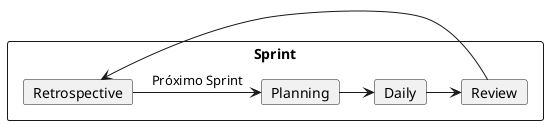
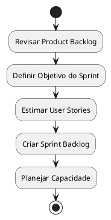
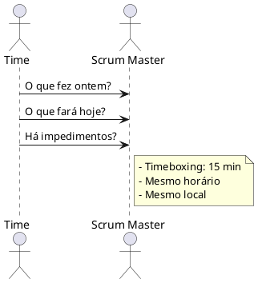
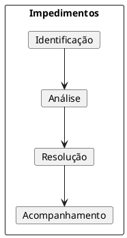
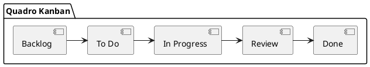
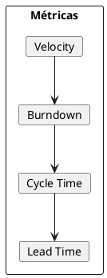
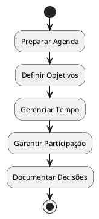
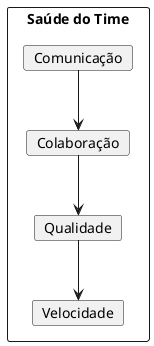
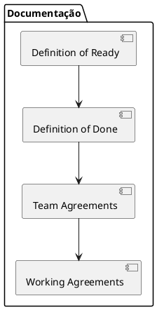

# Documentação do Scrum Master

## Descrição do Papel
O Scrum Master é responsável por facilitar o processo Scrum, remover impedimentos da equipe e promover práticas ágeis efetivas para maximizar a produtividade e qualidade das entregas.

## Execução das Responsabilidades no Projeto

### 1. Framework Scrum



### 2. Rituais Ágeis

#### Sprint Planning


#### Daily Scrum


### 3. Gestão de Impedimentos



## Ferramentas e Práticas

### 1. Quadro Kanban


### 2. Métricas Ágeis


### 3. Facilitação de Reuniões


## Práticas de Melhoria Contínua

### 1. Retrospectivas
```markdown
## Template de Retrospectiva

### 1. O que foi bem?
- Pontos positivos
- Conquistas
- Práticas efetivas

### 2. O que pode melhorar?
- Desafios
- Obstáculos
- Oportunidades

### 3. Ações
- Responsável
- Prazo
- Métricas
```

### 2. Health Check


## Comunicação e Documentação

### 1. Relatórios
```markdown
## Status Report

### Sprint Overview
- Sprint Goal:
- Start Date:
- End Date:
- Velocity:

### Progress
- Completed Stories:
- Story Points Delivered:
- Blockers Resolved:

### Team Health
- Moral:
- Productivity:
- Quality:
```

### 2. Documentação Ágil


## Principais Responsabilidades

### 1. Com o Time
- Facilitar eventos Scrum
- Remover impedimentos
- Proteger o time
- Promover auto-organização
- Coaching ágil

### 2. Com a Organização
- Promover práticas ágeis
- Auxiliar transformação
- Treinar outros times
- Compartilhar conhecimento
- Melhorar processos

## Principais Entregáveis
1. Facilitação de eventos Scrum
2. Relatórios de progresso
3. Documentação de processos
4. Métricas de agilidade
5. Planos de melhoria

## Métricas de Sucesso
- Velocidade do time
- Satisfação da equipe
- Previsibilidade de entregas
- Qualidade do produto
- Maturidade ágil 